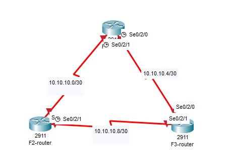
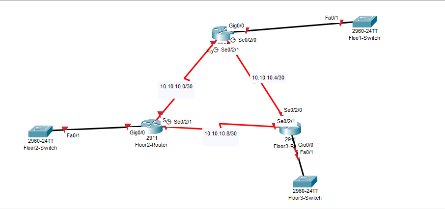
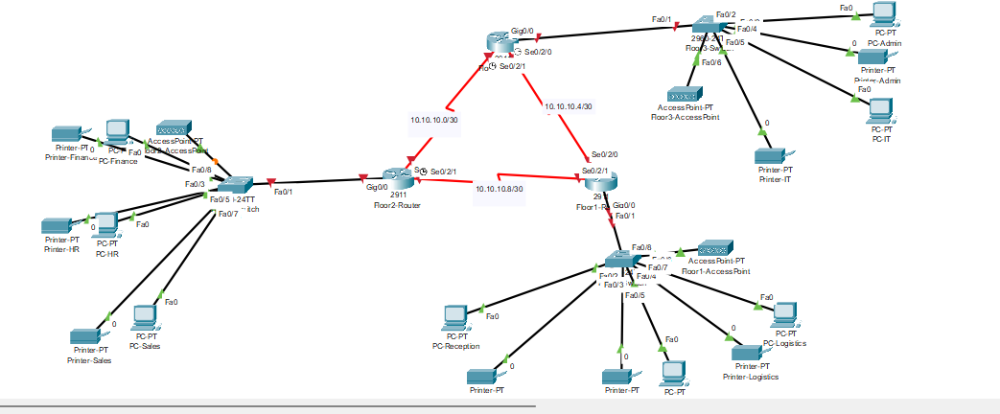
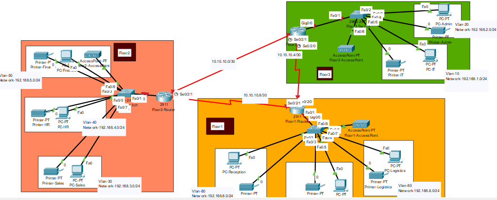
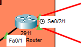
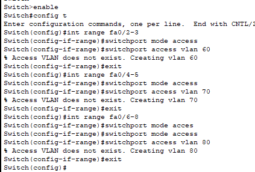

# Case Study and Requirements

Implement Vic Modern Hotel network
- The hotel has 3 floors
    - 1st floor: 3 department -> Reception, store and Logistics
    - 2nd floor: Finance, HR and Sales/Marketing
    - 3rd floor: IT and Admin


- There should be three routers connecting each floor (all placed in the server room in IT department).
- All routers should be connected to each other using serial DCE cable.
The network between the routers should be 10.10.10.0/30,10.10.10.4/30 and 10.10.10.8/30.
Each floor is expected to have one switch (placed in the respective floor).
Each floor is expected to have WIFI networks connected to laptops and phones.
Each department is expected to have a printer.
Each department is expected to be in different VLAN with the following details;
1st Floor;
- Reception- VLAN 60, Network of 192.168.8.0/24
- Store- VLAN 70, Network of 192.168.7.0/24
- Logistics- VLAN 80, Network of 192.168.6.0/24
2nd Floor;
- Finance- VLAN 50, Network of 192.168.5.0/24
- HR- VLAN 40, Network of 192.168.4.0/24
- Sales- VLAN 30, Network of 192.168.3.0/24
3rd Floor;
- Admin- VLAN 20, Network of 192.168.2.0/24
- IT- VLAN 10, Network of 192.168.1.0/24

- Use OSPF as the routing protocol to advertise routes.
- All devices in the network are expected to obtain IP address dynamically with their respective router configured as the DHCP server.
- All the devices in the network are expected to communicate with each other.
- Configure SSH in all the routers for remote login.
- In IT department, add PC called Test-PC to port fa0/1 and use it to test remote login.
Configure port security to IT-dept switch to allow only Test-PC to access port fa0/1 (use sticky method to obtain mac-address with violation mode of shutdown.)


# Implementation
- So in order to connect the router with serial cable, we need to install the serial port in the router


- Configuring the The network between the routers should be 10.10.10.0/30,10.10.10.4/30 and 10.10.10.8/30.


- Each floor will have a switch:



- After setting up the devices:


- Adding annotation


#### Configuring the serial interface, and the gigaethernet interface

```cmd
enable
configure terminal
interface se0/2/0 
no shutdown

clock rate 64000 #if it has a clock symbol
```
- Repeat with other interface


#### Creating vlan interface for floor 1


And here is the information of VLAN, by typing `show vlan brief`
```

VLAN Name                             Status    Ports
---- -------------------------------- --------- -------------------------------
1    default                          active    Fa0/9, Fa0/10, Fa0/11, Fa0/12
                                                Fa0/13, Fa0/14, Fa0/15, Fa0/16
                                                Fa0/17, Fa0/18, Fa0/19, Fa0/20
                                                Fa0/21, Fa0/22, Fa0/23, Fa0/24
                                                Gig0/1, Gig0/2
60   VLAN0060                         active    Fa0/2, Fa0/3
70   VLAN0070                         active    Fa0/4, Fa0/5
80   VLAN0080                         active    Fa0/6, Fa0/7, Fa0/8
1002 fddi-default                     active    
1003 token-ring-default               active    
1004 fddinet-default                  active    
1005 trnet-default                    active  
```

- Also remember to set the interface that connect to the router to trunk mode


### Creating vlan interface for floor 2
Switch#show vlan brief

VLAN Name                             Status    Ports
---- -------------------------------- --------- -------------------------------
1    default                          active    Fa0/9, Fa0/10, Fa0/11, Fa0/12
                                                Fa0/13, Fa0/14, Fa0/15, Fa0/16
                                                Fa0/17, Fa0/18, Fa0/19, Fa0/20
                                                Fa0/21, Fa0/22, Fa0/23, Fa0/24
                                                Gig0/1, Gig0/2
30   VLAN0030                         active    Fa0/6, Fa0/7, Fa0/8
40   VLAN0040                         active    Fa0/4, Fa0/5
50   VLAN0050                         active    Fa0/2, Fa0/3
1002 fddi-default                     active    
1003 token-ring-default               active    
1004 fddinet-default                  active    
1005 trnet-default                    active


## creating vlan interface for floor 3

VLAN Name                             Status    Ports
---- -------------------------------- --------- -------------------------------
1    default                          active    Fa0/7, Fa0/8, Fa0/9, Fa0/10
                                                Fa0/11, Fa0/12, Fa0/13, Fa0/14
                                                Fa0/15, Fa0/16, Fa0/17, Fa0/18
                                                Fa0/19, Fa0/20, Fa0/21, Fa0/22
                                                Fa0/23, Fa0/24, Gig0/1, Gig0/2
10   VLAN0010                         active    Fa0/4, Fa0/5, Fa0/6
20   VLAN0020                         active    Fa0/2, Fa0/3
1002 fddi-default                     active    
1003 token-ring-default               active    
1004 fddinet-default                  active    
1005 trnet-default                    active 


### Configure routers'interface IP address

- using router ospf 10
- and adding the network ipaddress submask area 0

- area 0: This assigns the network to OSPF Area 0. Area 0 is the backbone area in OSPF, and all other areas must connect to it for inter-area routing.

